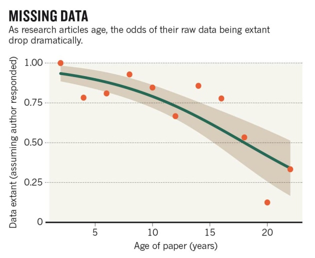
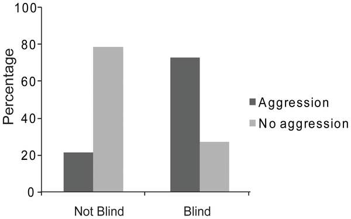

Data
========================================================
author: I. Bartomeus

Science = Ideas + Data
========================================================

- Data is at the core of the scientific process. 
- We need to take care of it.
    * Ensure it is accurate
    * It is easy to use
    * It is preserved in the long term

Science is changing: Data sharing culture is stablishing
========================================================

- Open science helps advance Science (i.e. reproducibility)
- Advance your career (increase collaborations, [enhance citations](http://www.plosone.org/article/info%3Adoi%2F10.1371%2Fjournal.pone.0000308))
- Mandatory by main Journals (BES, PLoS, Porc B,...)

More later...

Most Important
========================================================

- We are losing data!

Which is your Data life cycle?
========================================================

Which is Data life cycle?
========================================================

- understanding your data needs
- collecting data 
- entering data 
- cleaning data 
- storing data 
- manipulating data
- re-using data

What do you think of before collecting data?
============================================

What do you think of before collecting data?
============================================

- Think what you will need (think a lot)
- Power analysis?
- In which format you will need it
- How are you going to use it (explicitelly)
- write detailed protocols (helps working incremental)

What do you do to collect high quality data?
============================================

- use entry sheets 
- double labeling of samples when possible
- standardize coding (4_NitrogenPhosphurous > 4NP > 4)

What do you do to collect high quality data?
============================================
- double blind when possible ([video about autosuggestion](http://youtu.be/0bG7EFhMw8w))

How do you enter data?
===========================

How do you enter data?
===========================

- Software:
    Excel, GoogleDrive (forms), OpenOffice...
> But remember, Excel is a data entry program, nothing else.*

- Keep the link between physical and digital world
- Use a consistent style (have [style guideline](https://github.com/ibartomeus/misc_func/blob/master/Style.md))

*or if you have less than 10 rows, 4 columns...

Database software
=====================
- related csv files 
- MS Access (only works on PC)
- Filemaker Pro (only works on PC and Mac)
- SQL (require some set up): SQLite, MySQL, PostgreSQL (advantanges for spatially-explicit data compared with MySQL and open source)
- MariaDB – drop-in replacement for MySQL (even Google switched from MySQL to MariaDB)
- MongoDB – open source, no-SQL database
- Metadata:
   * Ecological Metadata Language (EML) – standard way to format metadata for ecology based in XML
   * [Morpho](https://www.dataone.org/software-tools/morpho) – helps you write your metadata

How do you clean your Data? 
=============================

- Note: This is not data transformation, is about knowing your data is robust.

How do you clean your Data? 
=============================
- check impossible values vs improbable values
- secure data quality 
- plot your data

> Check your data: If you find no errors, look up again

Ascombe's quaasrtet
================================

And always plot your data...

Ascombe's quaasrtet
================================
[Anscombe's quaasrtet](http://en.wikipedia.org/wiki/Anscombe's_quartet)

- Mean of x in each case -> 9 (exact)
- Variance of x in each case -> 11
- Mean of y in each case	-> 7.50 
- Variance of y in each case ->	4.1
- Correlation between x and y in each case -> 0.816
- Linear regression line in each case	-> y = 3.00 + 0.500x 

Where to do you store your Master Data? 
====================================================

- Note: entering and storing are different things!
- Do you have a Master data?  

Where to do you store your Master Data? 
====================================================

- Master data:
- Metadata (for others, and for you!)
- Local repositories: csv, database (MySQL, Access, MongoDB...)
- Online repositories: csv, database (MySQL, Access, MongoDB...)
- Online public repositories: [Dryad](http://datadryad.org/), [Figshare](http://figshare.com/), ...

- Use plain & standard formats (e.g. .txt, .csv, GenBank, nexus… )
- Licence it! CC0
- use a tidy data framework

Repositories
===========================
- [Dryad](http://datadryad.org/)
- [Figshare](http://figshare.com/)
- Data papers: Ecological Archives (ESA), F1000Research, etc...
- [DataONE](http://www.dataone.org/what-dataone)
- Specialized Networks
   * The Knowledge Network for Biocomplexity ([KNB](https://knb.ecoinformatics.org/))
   * Global Population Dynamics Database ([GPDD](http://www3.imperial.ac.uk/cpb/databases/gpdd))
   * [Gbif](http://www.gbif.org/)
   * [VertNET](http://vertnet.org/) 
   * etc...    
   
Note: check out [rOpenSci](http://ropensci.github.io/) to retrieve data!

Tidy data:
================

- Each variable forms a column
- Each observation forms a row
- Each data set contains information on only one observational unit of analysis (e.g., Genus, species, species visits)

Use concepts from relational databases.

> ... it is 100 times easier to turn data from list form to cross-tab than vice-versa, particularly if you don’t code- you can actually do it very easily in Excel using Pivot tables. Your master dataset should be in list form. 

[@cbahlai](http://practicaldatamanagement.wordpress.com/page/2/)

Where do you manipulate your data? 
===================================

Where do you manipulate your data? 
===================================

- Never manipulate Master data.
- Use a scripting lenguage (e.g. R) to make it reproducible
    * You can't reproduce… if you don't understand where a number came from.
    * You can't reproduce… what you don't remember. And trust me: you won't.
    * You can't reproduce… what you've lost. What if you need access to a file as it existed 1, 10, or 100, or 1000 days ago? - incremental back up (Git, Dropbox, Time machine...)
[Vargas lab](http://rpubs.com/bpbond/14911)

- Packages that simplify your life (`reshape`, `dplyr`)

How my projects looks like
===================================

project/
    
    data/
        
        master.csv
        
        data_analysis_y.csv
    
    get_data.R 
    
    analysis_x.R
    
    analysis_y.R
    
    Figures/
    
    ms/
    
Do you re-used data? It was easy?
================================

Do you re-used data? It was easy?
================================
- cleaning, securing, understanding and realising data is 100 times harder a posteriori.
- Re-use your data
- Other people data

How owns your data?
======================

How owns your data?
======================

- Yourself?
- Your advisor?
- The project?
- The funding agency?
- Your University?
- Science -> Free your data!

And if you don't know the answer: find out now!

Do you share your data? Why?
========================================================

Interested in discussion [here:](http://datapub.cdlib.org/2014/03/13/lit-review-plosfail-and-data-sharing-drama/)

Do you share your data? Why?
========================================================
- We share ideas in publications
- Why not data?
- The only way to reproducibility

>"I don't publish my _data_, someone may use them to write his own papers!"

>"I can share with you my _data_, but only if I become a coauthor in any of your papers using it"

Data sharing
========================================================

>"I don't publish my _hypothesis_, someone may use them to write his own papers!"

>"I can share with you _the conclusions of the paper_, but only if I become a coauthor in any of your papers using them"

- scooping is rare in ecology 
- you are in best position to understand your data
- people will do new things with your data

Data sharing
========================================================

>"Nobody will understand my data"

Do better metadata 

>"My data is not interesting"

Let others judge

>"My data can be missinterpreted"

Do better metadata and trust researchers

Resources:
=======================

[Tidy data paper](http://vita.had.co.nz/papers/tidy-data.pdf)

Must read about Data:
[Nine simple ways to make it easier to (re)use your data](http://library.queensu.ca/ojs/index.php/IEE/article/view/4608)

[Some Simple Guidelines for Effective Data Management](http://www.esajournals.org/doi/abs/10.1890/0012-9623-90.2.205)

More:
[Best practice for biodiversity data management and publication](http://www.sciencedirect.com/science/article/pii/S000632071300373X)

[An introduction to data cleaning with R](http://www.cbs.nl/NR/rdonlyres/951A0593-3D4A-4C33-86B3-A0AA18E2E976/0/201313x10pub.pdf)

[Paper on Git and reproducibilty](http://link.springer.com/article/10.1186%2F1751-0473-8-7)

Resources:
=======================

Data sharing:
[Open data](http://www.sciencemag.org/content/331/6018/703.abstract)

[practice and perceptions](http://www.plosone.org/article/info%3Adoi%2F10.1371%2Fjournal.pone.0021101)

[enhanced citations and re-use](https://peerj.com/articles/175/)

[more on data sharing enhance citations](http://www.plosone.org/article/info%3Adoi%2F10.1371%2Fjournal.pone.0000308)

[who shares data](http://www.plosone.org/article/info%3Adoi%2F10.1371%2Fjournal.pone.0018657)

Resources:
=======================

[For Excel fans](http://f1000research.com/articles/3-6/v1)
 
[Best practices on Data One](http://www.dataone.org/best-practices)

[Data Management Practices](http://www.prometheusresearch.com/good-data-management-practices-for-data-analysis-tidy-data-part-2/)

[Ref data lost](http://www.cell.com/current-biology/abstract/S0960-9822%2813%2901400-0)

Blogs worth checking:
[http://practicaldatamanagement.wordpress.com/](http://practicaldatamanagement.wordpress.com/)

Licence your data:
[Licences](http://opendefinition.org/licenses/#Data)

[Example on why use apropiate Licences](http://rossmounce.co.uk/2014/03/13/discussing-open-access-with-the-linnean-society/)

Resources:
=======================
Other presentation: [R and reproducibility](http://rpubs.com/bpbond/14911)

about dplyr: [dplyr blog](http://www.ancienteco.com/2014/01/introduction-to-dplyr-data-manipulation.html) and  [dplyr example](http://www.ancienteco.com/2014/01/introduction-to-dplyr-data-manipulation.html)

